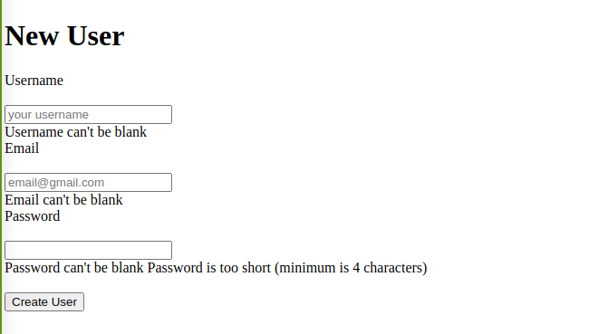

# Micro-Reddit

In this project, we created a simple back end of a user and Form for Signup and Form Authentication.



We created a Form with Authetication and model for User with Authentication

## Built With

- Ruby v 2.7.1
- Rails app gem
- Form Authentication

### Setup

To run this project locally, please ensure you have Ruby installed on your machine, then clone this repository by running.

```bash
git clone https://github.com/Wusinho/Bear_Metail_forms.git
```

After cloning open the file and write in terminal:

```bash
 rails console
```

### Authors

👤 <b>Heber Lazo</b>

- Github: [@Wusinho](https://github.com/Wusinho)
- LinkedIn: [Heber Lazo](https://www.linkedin.com/in/heber-lazo-benza-523266133/)

👤 **Abdul Khaliq**

- Github: [@abdulkhaliqdev](https://github.com/abdulkhaliqdev)
- Twitter: [@abdulkhaliqdev](https://twitter.com/Abdulkhaliqdev)
- LinkedIn: [LinkedIn](https://www.linkedin.com/in/abdul-khaliq-89452b1a9/)

## Show your support

Give a ⭐️ if you like this project!

## Acknowledgments

- Microverse
- The Odin Project

## 📝 License

This project is [MIT](LICENSE.md) licensed.
